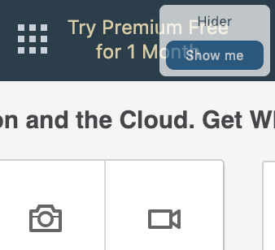

# Chrome extension: LinkedIn Hider

Some poeple don't want others to see when you've visited their LinkedIn account, so you hide yourself in LinkedIn privacy settings. This place is well hidden.

Other times you want to see who's been viewing you, but to see that information you have to enable your full visibility, which means finding that place in privacy settings again, ooh.. 

I say NO, I deserve better than this! This extension always shows a modal on top of the LinkedIn page, on it you have 2 buttons to "Anonymise" yourself fully OR make yourself fully "Visible" with just a click of a button. 
Once you're fully visible, you can see all kinds of interesting stats about who's been viewing you, what's the % rise in lookups etc.

